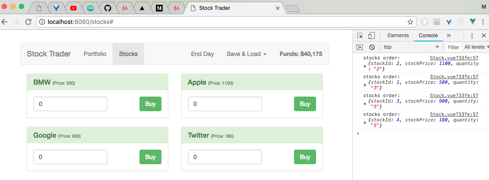
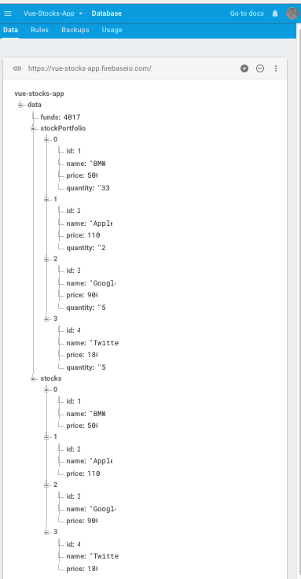
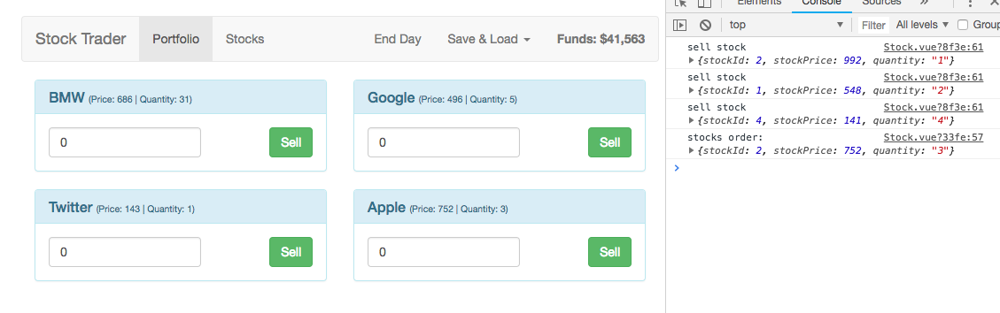
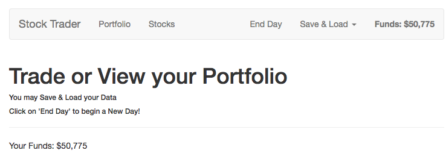

# Vue Stocks App
> A Vue.js project for simulating stock trades  

Basic list app made with Vue.js and thank you to Maximilian Schwarzmuller for tutorial and codebase: https://www.udemy.com/vuejs-2-the-complete-guide/learn/v4/

